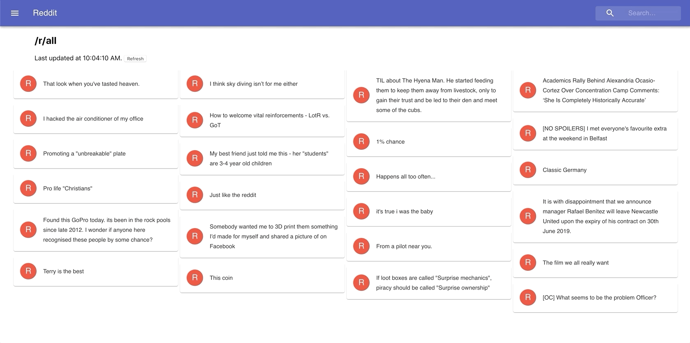

# crederabootcamp
Final two days of Credera's Front-end bootcamp

This project was bootstrapped with [Create React App](https://github.com/facebook/create-react-app).

## Objectives
This project will reflect both solo assignment and pair programming excercise for the last two days. You are allowed to get a headstart and complete the next objectives prior to being assigned.

Order of Completion:
1) (Solo, July 18th) Turning the page into a multi-page single page application with a form that console logs the input on submission 
2) (Pair, July 18th) Adding complexity to the form (i.e. Login/Create Account form)
3) (Solo, July 19th) Refactor the application to allow searches for other subreddits
4) (Pair, July 19th) Implement an API call that can persist, update, and retrieve data (Redux/Hooks)

More details on each task:
##### 1) As a user, I would like to be able to navigate to different pages on the application. (React-router)

##### 2) As a user, I would like to create an account on the application.

##### 3) As a user, I want to be able to search for other subreddits.

##### 4) As a user, I would like to be able to grab the latest posts without having to refresh the page

## Additional Note(s)
The components were created in different ways to demonstrate different ways of creating components (Class/State vs Functional/Stateless). React is making stateless its preferred component creation; however, classes will be relevant for lifecycles

## Available Scripts

In the project directory, you can run:

### `npm install`

This installs all the required dependencies needed to execute this project. You will need to run this after pulling down the repository.

### `npm start`

Runs the app in the development mode. 
Open [http://localhost:3000](http://localhost:3000) to view it in the browser.

The page will reload if you make edits. 
You will also see any lint errors in the console.

## Learn More

You can learn more in the [Create React App documentation](https://facebook.github.io/create-react-app/docs/getting-started).

To learn React, check out the [React documentation](https://reactjs.org/).

## Additional Resources
##### Roadmap: https://github.com/adam-golab/react-developer-roadmap

##### React Router: https://reacttraining.com/react-router/web/guides/quick-start
##### Redux: https://redux.js.org/introduction/getting-started
##### Hooks: https://reactjs.org/docs/hooks-overview.html
##### Material-UI: https://material-ui.com/

##### Forms: 
- [React Forms](https://reactjs.org/docs/forms.html)
- [Redux Form](https://redux-form.com/7.0.3/)
- [Formik](https://github.com/jaredpalmer/formik)
- [Final Form](https://github.com/final-form/react-final-form)

##### Styling (Not required in this project):
- [Emotion.js](https://github.com/emotion-js/emotion) (Personal Recommendation)
- [Styled Components](https://www.styled-components.com/)
- [CSS Loader](https://github.com/webpack-contrib/css-loader)
